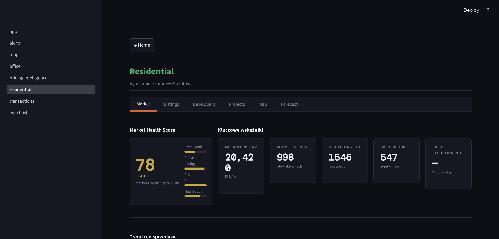

# Warsaw Market Intelligence

> **Real Estate Market Intelligence Platform for Commercial Asset Management**

A decision-support system that continuously monitors office leasing and residential sales markets in Mokotów, Warsaw — delivering structured analytics, price intelligence, competitive tracking, and developer project monitoring through an interactive dashboard.

Built to support asset management, investment screening, and competitive intelligence workflows for commercial real estate professionals.

---

## Business Problem

Commercial real estate decisions — leasing strategy, acquisition underwriting, competitive positioning — require continuous awareness of market dynamics. Yet the data needed to make those decisions is fragmented, unstructured, and scattered across dozens of listing sources updated daily.

Asset managers and investment professionals typically face:

- **No unified view** of competing supply, asking rents, and price trends
- **Static snapshots** instead of time-series price intelligence
- **Opaque developer pipelines** with no unit-level visibility into new supply
- **Manual monitoring** of competitor buildings, projects, and pricing
- **Delayed awareness** of market shifts — by the time changes are noticed, decisions have already been made on stale data

Ocean Plaza MI solves this by automating data collection, structuring it into an analytical database, and surfacing actionable intelligence through a purpose-built dashboard updated daily.

---

## Key Features

### Office Market Intelligence

| Feature | Description |
|---|---|
| **Market Overview** | Aggregated KPIs across 4 dimensions: asking rents, available supply, space metrics, and market structure |
| **Market Health Score** | Composite 0–100 score (STRONG / STABLE / CAUTIOUS / DISTRESSED) across rent trend, absorption, vacancy, and supply stability |
| **Competition Tracking** | Building-level rent and availability monitoring for the Służewiec office submarket |
| **Building Profiles** | Drill-down into individual buildings — historical rent evolution, available floor plates, price range |
| **Rent Intelligence** | Median, mean, min/max asking rents per m²; distribution analysis; trend forecasting |
| **Office Alerts** | Automated detection of significant rent changes, new supply events, and delisting signals |

### Residential Sales Intelligence

| Feature | Description |
|---|---|
| **Residential Market Overview** | Market-wide KPIs: median price/m², active listings, price cut ratio, sales velocity |
| **Market Health Score** | Composite scoring across price trend, listing absorption, price cut dynamics, and supply stability |
| **Developer Tracking** | Named developer identification, project inventory, unit-level pricing per developer |
| **Project Profiles** | Per-project drill-down: unit inventory, price/m² distribution, floor plans, room mix |
| **Price Intelligence** | Unit-level price change tracking from first observation; % price cut detection |
| **Residential Alerts** | Price reductions, new project launches, sell-through velocity signals |

### Watchlist

Track specific listings across both market segments. For every watched offer, the platform records the price at the time of adding to the watchlist and continuously tracks subsequent price movements — surfacing the exact change in PLN and % since first observed.

### Alert Engine

Rule-based alert generation across both modules. Alerts are categorized by type (price change, new supply, delisting) and severity, displayed in a dedicated Alert Center with timestamps and current vs. previous values.

---

## Deep Developer Project Tracking

Most platforms treat a developer project as a single listing. Ocean Plaza MI tracks each individual apartment within a project separately.

For every active development project in the Mokotów market, the platform captures:

- **Project-level**: developer name, location, total units, median asking price, price/m² range, delivery status
- **Unit-level**: individual apartment area, room count, floor, asking price, price/m², availability status
- **Inventory tracking**: units available vs. sold out; sell-through rate over time
- **Price distribution**: histograms, box plots, and scatter charts (area vs. price/m², colored by room count)

This granularity allows investment professionals to assess developer pricing discipline, identify distressed units, and benchmark new supply against the secondary market — at the apartment level, not just the project level.

---

## Price Intelligence

Static listing prices tell you where the market was. Price change data tells you where it is going.

Ocean Plaza MI captures every price change across all monitored listings and surfaces:

| Metric | What It Reveals |
|---|---|
| **Price change since listing** | How much a seller has moved from their original ask |
| **Price change since watchlist add** | Movement since you first identified the asset |
| **Price cut ratio** | Share of active listings that have been reduced — a leading indicator of market softening |
| **Median price trend** | Rolling median price/m² over time — filters out outliers |
| **Developer pricing intelligence** | Price evolution by developer across all their active projects |
| **Historical snapshots** | Full price time series per listing, enabling per-asset valuation narratives |

Price changes are more informative than static prices because they reveal seller motivation, market liquidity, and the gap between expectation and market reality.

---

## Office Competition Intelligence

The platform tracks the competitive supply landscape in the **Służewiec office submarket** — the primary office cluster surrounding Ocean Plaza.

Monitored competitor buildings include:

- **Ocean Plaza** — anchor asset, full rent and availability history
- **Curtis Plaza** — direct competitor, grade-A supply
- **New City** — mixed-use office competition
- **Marynarska Business Park** — large-format campus supply
- **Eurocentrum, Platinium Business Park, Adgar Park West** — broader submarket context

For each building, the platform tracks: available m², asking rent per m²/month, floor plate size, building class (A / B+ / B), and historical rent trends. This enables lease negotiation support, tenant retention analysis, and competitive positioning decisions grounded in current market data.

---

## System Architecture

```
┌─────────────────────────────────────────────────┐
│           Public Real Estate Listings            │
│        (Warsaw Mokotów — Office & Residential)   │
└─────────────────────┬───────────────────────────┘
                      │
                      ▼
┌─────────────────────────────────────────────────┐
│         Playwright Data Collection Layer         │
│  • scraper_office.py     (daily, headless)       │
│  • scraper_residential.py (daily, headless)      │
│  • scraper_developer.py   (daily, headless)      │
│  • Automated via cron @ 07:00 daily              │
└─────────────────────┬───────────────────────────┘
                      │
                      ▼
┌─────────────────────────────────────────────────┐
│              SQLite Database Layer               │
│  • listings          — master offer registry     │
│  • snapshots         — daily price time series   │
│  • developer_projects — project master data      │
│  • scrape_runs       — pipeline audit log        │
│  • watchlist         — tracked offer registry    │
└─────────────────────┬───────────────────────────┘
                      │
                      ▼
┌─────────────────────────────────────────────────┐
│             Analytics Layer (analytics.py)       │
│  • KPI computation with period-over-period delta │
│  • Market Health Scoring (4-component, 0–100)    │
│  • Statistical distributions (median, IQR)       │
│  • Time-series forecasting (linear regression)   │
│  • Alert rule engine                             │
│  • Price change detection                        │
└─────────────────────┬───────────────────────────┘
                      │
                      ▼
┌─────────────────────────────────────────────────┐
│         Streamlit Dashboard (app.py + pages/)    │
│  • Office module     — 7 analytical tabs         │
│  • Residential module — 6 analytical tabs        │
│  • Alert Center      — prioritized feed          │
│  • Watchlist         — tracked offer monitor     │
└─────────────────────┬───────────────────────────┘
                      │
                      ▼
┌─────────────────────────────────────────────────┐
│       Decision Support & Market Intelligence     │
│  Asset Management · Investment Screening ·       │
│  Competitive Monitoring · Leasing Strategy       │
└─────────────────────────────────────────────────┘
```

---

## Technology Stack

| Technology | Version | Role |
|---|---|---|
| **Python** | 3.9+ | Core runtime; data pipeline; analytics logic |
| **Playwright** | ≥1.44 | Headless browser automation for data collection; handles dynamic JS-rendered content |
| **SQLite** | built-in | Embedded relational database; time-series snapshots; zero-infrastructure deployment |
| **Pandas** | ≥2.2 | DataFrame operations; data wrangling; aggregation pipelines |
| **NumPy** | ≥1.26 | Numerical computation; statistical calculations |
| **SciPy** | ≥1.13 | Statistical distributions; regression analysis; market health scoring |
| **Streamlit** | ≥1.35 | Interactive dashboard; multi-page application; real-time data editing |
| **Plotly** | ≥5.22 | Interactive visualizations; time-series charts; distribution plots; maps |

---

## Dashboard Structure

### Office Module (`/office`)

| Tab | Content |
|---|---|
| **Overview** | Market Health Score · KPI grid (15 metrics across 4 groups) · Rent trend inline chart · Distribution histograms |
| **Listings** | Full filterable listing table with price tracking, watchlist, and direct links |
| **Competition** | Competitor building matrix · Rent benchmarking · Available space comparison |
| **Buildings** | Building-level profiles · Historical rent evolution · Active floor inventory |
| **Map** | Geospatial distribution of active office supply |
| **Pipeline** | Forward supply analysis · Developer project pipeline |
| **Forecast** | Rent trend forecast (30/60/90-day horizon) based on historical trajectory |

### Residential Module (`/residential`)

| Tab | Content |
|---|---|
| **Market** | Market Health Score · KPI grid · Price/m² trend · Price cut ratio evolution |
| **Listings** | Full filterable listing table with price tracking and watchlist |
| **Developers** | Developer league table · Median price by developer · Unit count and inventory |
| **Projects** | Project-level summary table · Price range · Sell-through velocity |
| **Map** | Geospatial distribution of active residential supply |
| **Forecast** | Price/m² forecast based on historical median trend |

**Project Profile** (drill-down from Projects tab):
- Unit inventory table with individual apartment data
- Scatter chart: area vs. price/m² colored by room count
- Price/m² histogram and area histogram
- Room mix pie chart and price box plot by room count

### Alert Center (`/alerts`)

Dual-column alert feed — Office alerts and Residential alerts side by side. Each alert shows: severity badge, timestamp, alert type, current value vs. previous value, and the specific listing or market segment triggering the alert.

### Watchlist (`/watchlist`)

Unified view across both market segments. Displays price at watchlist addition, current price, and delta in PLN and % for each tracked offer. Includes portfolio-level KPIs (total watched, active, potaniało/zdrożało counts) and a price history chart for all watched offers.

---

## Key Metrics

### Office Market

| KPI | Why It Matters |
|---|---|
| **Asking Rent (PLN/m²/month)** | Primary leasing cost benchmark; drives tenant affordability and landlord yield |
| **Median Asking Rent** | Outlier-resistant market center; more reliable than mean for negotiation anchoring |
| **Available Supply (m²)** | Direct measure of competitive pressure on the subject asset |
| **New Supply Added** | Forward indicator of future vacancy and rent pressure |
| **Leasing Velocity** | Rate at which available space is absorbed; reveals true demand depth |
| **Rent Change Tracking** | Directional signal; identifies whether market is firming or softening |
| **Price Cut Ratio** | Share of listings reduced — early warning of landlord capitulation |
| **Building Class Mix** | A/B/B+ split informs where demand is concentrating |

### Residential Market

| KPI | Why It Matters |
|---|---|
| **Median Price/m²** | Market center for residential pricing; investment underwriting anchor |
| **Mean Price/m²** | Reveals skew vs. median; higher mean = luxury segment pulling up average |
| **Active Listings** | Supply depth; affects negotiating leverage and time-to-close |
| **Price Cut Ratio** | % of sellers who have reduced — strongest leading indicator of price direction |
| **Sales Velocity** | Rate of new listings vs. delistings; measures absorption |
| **Price Change Since Listing** | Seller motivation signal; identifies motivated sellers vs. anchored asks |
| **Developer Median Price** | Benchmarks new supply against secondary market |
| **Unit Sell-Through Rate** | % of developer project units sold; reveals demand quality |

---

## Screenshots

| Screen | Preview |
|---|---|
| Home Screen |  |
| Office Overview |  |
| Residential Market |  |
| Developer Projects |  |
| Project Profile |  |
| Alert Center |  |

---

## Example Use Cases

### Asset Management — Ocean Plaza
Monitor competing office supply in Służewiec in real time. When a competitor building reduces asking rents or a large floor plate becomes available, receive an alert and assess leasing strategy implications before the next tenant negotiation.

### Investment Screening — Residential Acquisition
Identify residential assets where asking prices have been reduced multiple times (high cut ratio + long days-on-market). Cross-reference with median price/m² by subdistrict to quantify discount to market.

### Competitive Monitoring — Office Leasing
Track available m² and asking rent across Curtis Plaza, New City, Marynarska, and Eurocentrum weekly. Build a competitive supply timeline to support NOI forecasting and lease renewal assumptions.

### Developer Market Analysis
For any developer project in Mokotów, drill down to individual unit pricing, room mix, floor distribution, and sell-through velocity. Compare developer pricing strategies across the submarket to support land acquisition underwriting.

### Pricing Trend Analysis — Watchlist
Add target assets to the watchlist at initial screening. The platform automatically tracks every subsequent price change, building a negotiation history that quantifies how far a seller has moved and at what pace.

---

## Future Roadmap

| Initiative | Description |
|---|---|
| **PostgreSQL migration** | Replace SQLite with PostgreSQL for multi-user access, concurrent writes, and production deployment |
| **Geospatial analytics** | Isochrone mapping, submarket boundary analysis, walk-score integration |
| **Advanced forecasting** | ARIMA / Prophet time-series models replacing linear regression; confidence intervals |
| **Automated reporting** | Scheduled PDF/Excel market reports delivered via email; weekly market summary digests |
| **Enhanced Market Health Scoring** | Machine learning–based composite scoring incorporating macro indicators |
| **Expanded geographic coverage** | Additional Warsaw submarkets: Wola, Śródmieście, Wilanów |
| **Transaction data integration** | Combine listing data with notarial deed transaction records for bid-ask spread analysis |
| **Portfolio scenario modeling** | Stress-test NOI assumptions against simulated market scenarios |

---

## Installation

**Requirements:** Python 3.9+, Git

```bash
# 1. Clone the repository
git clone https://github.com/your-org/ocean-plaza-mi.git
cd ocean-plaza-mi

# 2. Create and activate virtual environment
python3 -m venv venv
source venv/bin/activate       # macOS / Linux
venv\Scripts\activate          # Windows

# 3. Install dependencies
pip install -r requirements.txt

# 4. Install Playwright browsers
playwright install chromium

# 5. Initialise the database
python database.py

# 6. Run initial data collection
python scraper_office.py
python scraper_residential.py
python scraper_developer.py

# 7. Launch the dashboard
streamlit run app.py
```

The dashboard will be available at `http://localhost:8501`.

**Automated daily updates** (macOS/Linux):

```bash
# Add to crontab — runs all scrapers at 07:00 daily
crontab -e
# Add the following line:
0 7 * * * cd /path/to/ocean-plaza-mi && venv/bin/python scraper_office.py >> logs/cron.log 2>&1 && venv/bin/python scraper_residential.py >> logs/cron.log 2>&1 && venv/bin/python scraper_developer.py >> logs/cron.log 2>&1
```

---

## Disclaimer

Ocean Plaza Market Intelligence aggregates and analyses **publicly available real estate listing data** for the purpose of market research and investment decision support. All data is sourced from publicly accessible listing platforms and is used solely for analytical purposes.

This platform is an internal analytical tool. It does not facilitate transactions, does not store personally identifiable information, and does not reproduce or redistribute listing content. All price data, market metrics, and analytics outputs are derived from publicly observable market information.

Market intelligence outputs represent analytical observations and should not be construed as investment advice. Users are responsible for independent verification of all data before making investment or leasing decisions.

---

## Positioning

Ocean Plaza Market Intelligence is a **decision-support and market-intelligence platform** for commercial real estate professionals.

It is not a listing aggregator. The platform's value lies in:

- **Continuity** — daily data collection building a proprietary time-series dataset unavailable from any single source
- **Granularity** — unit-level developer project tracking and per-listing price history
- **Intelligence** — composite market health scoring, alert generation, and trend forecasting layered on top of raw listing data
- **Workflow integration** — watchlist management, direct offer links, and exportable tables designed for the investment and asset management workflow

The underlying data is public. The intelligence layer — and the decisions it enables — is proprietary.
